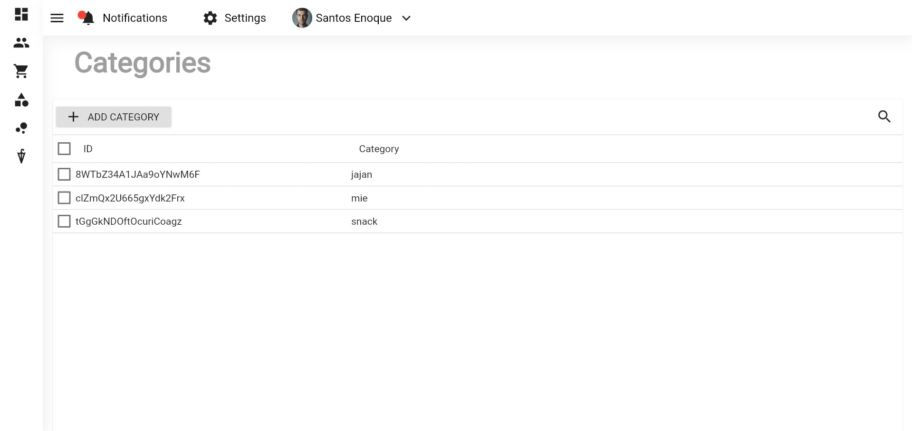

# ecommerce_admin_tut

Pemograman web perangkat bergerak

## Sudah terdapat

1. Wiget

2. Terdapat asset

3. konfigurasi pubspec.yaml

4. Layout

5. UI mudah di pahami

6. Link yang berfungsi

7. Koneksi database

8. Query benar

9. Website responsif

10. Tidak ada error

